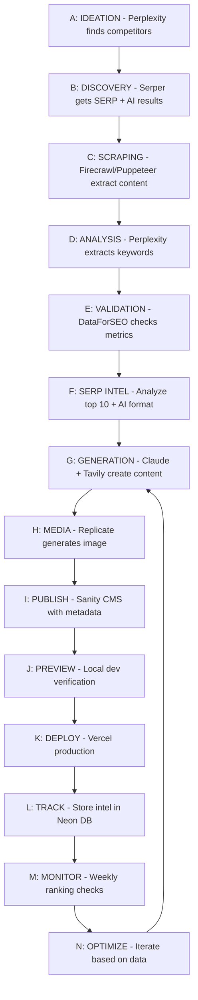
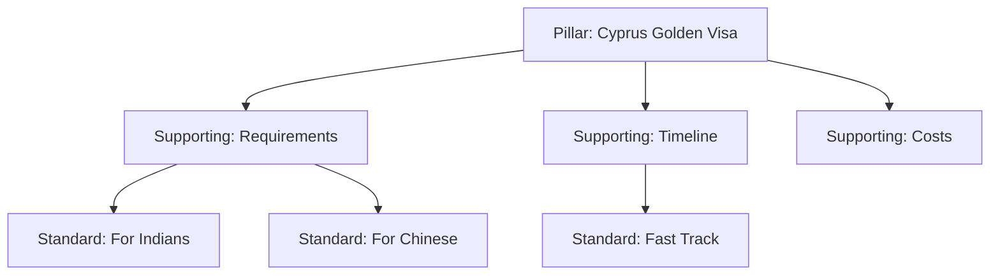

# 📋 RELOCATION-PRD-UNIFIED v3.0
**Product Requirements Document for Fresh Start Content Pipeline**  
**Last Updated**: September 29, 2025  
**Status**: Updated for New Naming Convention & Image-First Approach

---

## 🎯 Project Overview

### New Naming Convention ✅
**CRITICAL**: All services use consistent prefixed naming:
- **Local Directory**: `/Users/dankeegan/local-relocation`
- **GitHub Repository**: `github-relocation` (https://github.com/Londondannyboy/github-relocation)
- **Sanity Workspace**: `sanity-relocation`
- **Vercel Project**: `vercel-relocation`
- **Production Domain**: `relocation.quest` (to be switched after validation)

### Objectives
- Generate 1000 programmatic SEO articles for Relocation Quest (25 documented, 975 planned)
- Achieve 20,000+ organic visits/month within 90 days
- Capture 10-40% conversion rate from AI search traffic
- Build topical authority across relocation/immigration topics

### Success Metrics
- Quality score 80+ per article
- Zero broken links (Phase 1: no internal links)
- Top 3 Google rankings for comparison keywords
- GEO visibility in ChatGPT, Perplexity, Claude responses
- Search volume 200-500 minimum per target keyword

### Current Assets
- 91+ articles identified from old content
- 6 country videos with Mux IDs ready
- 100+ images in Sanity Media Library
- Universal schemas configured in quest-cms
- API stack configured and funded

### Tracking Documents (in `/Users/dankeegan/local-relocation/docs/`)
- **PRD**: This strategy document (RELOCATION-PRODUCT-REQUIREMENTS-DOCUMENT.md)
- **Live Tracker**: RELOCATION-LIVE-TRACKER.md (execution & keyword tracking)
- **Credentials**: RELOCATION-CREDENTIALS.md (API keys - git ignored)
- **Restart**: RESTART.md (fresh start guide)
- **Ideation**: RELOCATION-IDEATION.md (future features)
- **Claude**: CLAUDE.md (AI assistant context)

---

## 🔧 Technical Stack

### Core Technologies
- **Framework**: Astro 5.x + React + TypeScript
- **Styling**: Tailwind CSS 4.x
- **CMS**: Sanity Universal (93ewsltm/production)
- **Deployment**: Vercel (auto-deploy on push)
- **SEO**: @astrojs/sitemap (TO BE IMPLEMENTED)
- **Images**: Flux Pro via Replicate
- **Video**: MUX Player (optional, autoplay working)

### APIs & Credits
```markdown
✅ Perplexity API: Configured (see CREDENTIALS.md)
✅ Replicate API: Configured ($10 credit)
✅ DataForSEO: Configured ($50 credit, 5000+ keyword checks)
✅ Firecrawl: Configured
✅ Tavily: Configured (1000 free searches/month)
✅ Sanity: Multiple tokens configured
✅ Serper.dev: Configured ($0.0003/search)
```
**Note**: All API keys are stored in CREDENTIALS.md (git-ignored)

### MCP Servers
```json
"perplexity"        → Keyword extraction & competitor analysis
"replicate"         → Image generation (via Replicate.com)
"firecrawl"         → Competitor scraping
"puppeteer"         → Browser automation
"serper"            → SERP analysis
"sanity-quest"      → CMS operations
"google-search-console" → Performance tracking & ranking data
```

### Media Generation Models
```javascript
// Image Generation (Primary - FINALIZED)
{
  heroImages: 'black-forest-labs/flux-1.1-pro', // $0.003 per image, best quality
  format: 'AVIF',                               // 20% better than WebP
  fallback: 'WebP',                             // Browser compatibility
}

// Video Generation (Optional/Manual)
{
  heroVideos: 'MUX playback IDs',    // Manual addition when needed
  strategy: 'Generate async, add selectively'
}
```

---

## 🎬 MEDIA STRATEGY (Updated Sep 29, 2025)

### IMAGE-FIRST WITH OPTIONAL VIDEO ENHANCEMENT

#### Content Generation Pipeline:
```
1. Replicate SDXL → High-quality images → Immediate publication
2. Optional: Replicate/Luma → Videos → MUX → Manual addition
```

#### Each Article Has:
1. **Hero Image** - Generated via Replicate SDXL ($0.001)
   - Immediate publication with image
   - No blocking on media generation
   
2. **Optional MUX Video** - Can replace hero or add to content
   - Generate async after publication
   - Manual quality control
   - Selective use for high-value content
   - Golden Visa programs - unique video
   - Tax Optimization - unique video  
   - Company Formation - unique video
   - Business Investment - unique video
   - Digital Nomad - unique video
   - ALL categories get unique hero videos
   - Autoplay, muted, no controls
   - Videos should be generated/sourced uniquely
   
3. **Content Images** - At least 1 in body
   - Generated or from Unsplash
   - Related to specific sections
   
4. **Content Videos** - At least 1 in body
   - Autoplay, muted, no controls
   - Short titles only
   
5. **Links** - Both internal and external
   - Internal to categories/related content
   - External to authoritative sources

## 📊 Content Strategy

### Comparison Formula
```markdown
Countries: 6 × 6 × 10 topics = 360 pages
Visa Types: 10 × 10 × 5 aspects = 500 pages
Tax Regimes: 8 × 8 × 5 comparisons = 320 pages
Total Potential: 1,180 articles
```

### Priority Comparisons (Top 20)
1. Cyprus vs Malta - Tax Benefits
2. Dubai vs Singapore - Business Setup
3. Portugal D7 vs Cyprus Non-Dom
4. Caribbean CBI Programs Comparison
5. EU Golden Visa Rankings 2025
6. Malta vs Cyprus - Gaming Industry
7. Portugal NHR vs Cyprus Non-Dom Tax
8. Dubai Free Zone vs Mainland
9. Singapore PR vs Employment Pass
10. St. Kitts vs Antigua Citizenship

### Video Assets (Mux IDs)
- **Cyprus**: `ew9vFwrawM3Eq1MVGHUZwu4IPoFOHVv002Hal1ei02JXM`
- **Dubai**: `5br2hylJ4F009vDLHrxWZ3C7UDTw5901GcXYBjSOWNV8k`
- **Portugal**: `Oy1LRvO5eSoXGUTthBNS13r007WorSyGvf2YLh1keA5E`
- **Malta**: `aeX9W002bzUWYKu3Ryln4hLVAplzOm7DfUKm3iZqGGz00`
- **Singapore**: `dCBAYhMsKX7v00HaI1gHsW8tMI2HZDLlb01KJv5hGkpkI`
- **Caribbean**: `021dUb7I5L2G9dDKBWup4efv9Sxh7ZNAtElSbYkN8C2k`

---

## 🔄 Enhanced A→N Workflow Pipeline

### Complete Intelligence-Driven Content Creation Flow



## 🔄 Complete Workflow Pipeline

### Phase 0: Discovery (Find Competitors)
```javascript
// Using Serper.dev
Search for:
- "cyprus relocation services"
- "malta citizenship consultants"  
- "dubai business setup"
- "portugal golden visa"
- "singapore immigration"

Extract top 10 URLs from each search

// Using Puppeteer
Validate each site has:
- Blog/articles section
- Service pages
- Location pages

Output: Top 10 content-rich competitors
```

### Phase 1: Research (Extract Keywords) WITH SMART CACHING
```javascript
// SMART CACHING STRATEGY - HUGE COST SAVINGS
const competitorCache = {};

// Using Firecrawl ($0.05/page BUT CACHED)
async function scrapeCompetitor(url) {
  if (competitorCache[url]) return competitorCache[url];
  
  const content = await firecrawl.scrape(url);
  competitorCache[url] = content;
  return content;
}
// Result: ~50 unique pages × $0.05 = $2.50 (not $25!)

// Using DataForSEO (SELECTIVE)
// Tier 1 (100 keywords): Full metrics = $1
// Tier 2 (200 keywords): Basic check = $2  
// Tier 3 (700 keywords): Skip = $0
// Total: $3 (not $10)

// Using Serper ($0.0003 - use liberally!)
// Cache SERP data for keyword variations
const serpCache = {};
"Cyprus golden visa" → cached
"Cyprus golden visa 2025" → use cached base

// TOTAL REALISTIC COST: $12-42 for 1000 articles
```

### Phase 2: Analysis (SERP Metrics)
```javascript
// For each target keyword

// Using Serper.dev
Get top 5 ranking pages
Extract SERP features

// Using Puppeteer
Visit each top result
Extract:
- Word count
- Keyword density  
- Headers structure (H2/H3 count)
- Features (calculator, FAQ, tables)
- Image count
- Internal/external links

Create "Beat Sheet":
- Target word count = top 3 average + 10%
- Required features = all competitor features + 1
- Keyword frequency = match top performer
```

### Phase 3: Generation (Create Content)
```javascript
// Using Claude Code
Generate article with:
- Word count from beat sheet
- All required features
- SEO methodology applied
- 2025 fresh data

// Using Tavily
Research current data:
- Latest regulations (2024-2025)
- Current processing times
- Recent policy changes
- Fresh statistics

// Using Replicate (MANDATORY)
Generate UNIQUE hero image for EVERY article:
"Cyprus marina luxury vs Malta harbor, 
professional photography, 16:9, 
high resolution"

// DO NOT reuse existing Mux videos or Unsplash images for hero
// ALWAYS generate new, unique image with Replicate

Output: Complete article with unique AI-generated image
```

### Phase 4: Media Generation (Tiered Video/Image Strategy)

#### 4.1 Video Model Tiers
```javascript
const VIDEO_TIERS = {
  HERO: {
    model: 'luma-ray2', // Premium for pillar content
    budget: '$0.50/video',
    use_case: 'Hero videos for pillar pages (Tier 1)',
    quality: 'Cinematic quality, 1080p, 5-10 seconds',
    when: 'Commercial value > $10k/month OR pillar content'
  },
  CONTENT: {
    model: 'stable-video-diffusion', // Mid-tier
    budget: '$0.10/video',
    use_case: 'In-content explanatory videos',
    quality: 'Good quality, 720p, 3-5 seconds',
    when: 'Supporting pages, how-to sections'
  },
  FILLER: {
    model: 'zeroscope-v2', // Budget option
    budget: '$0.02/video',
    use_case: 'Supplementary visuals, B-roll',
    quality: 'Basic quality, 480p, 2-3 seconds',
    when: 'End of article ambiance, transitions'
  }
}

// Video Reuse Detection
async function checkExistingVideo(topic) {
  // Search Sanity for existing videos by:
  // - Title/description match
  // - Country/location match
  // - Topic similarity
  // Reuse if match > 80% similarity
}
```

#### 4.2 Image Generation with Full SEO
```javascript
const imageMetadata = {
  filename: 'seo-optimized-filename.webp',
  alt: 'Descriptive alt text with keyword',
  title: 'Image title for SEO',
  caption: 'Informative caption',
  description: 'Full description for search',
  attribution: 'Source/creator credit'
}

const image = await replicate.run(
  "stability-ai/flux-schnell",
  { 
    input: { 
      prompt: imagePrompt,
      num_outputs: 1,
      aspect_ratio: "16:9",
      output_format: "webp",
      output_quality: 90
    } 
  }
)

// Track model used
platformsUsed.push('Replicate:flux-schnell')
```

### Phase 5: Publishing (Sanity CMS)
```javascript
// For each article
{
  title: "Cyprus vs Malta: Complete 2025 Tax Comparison",
  slug: "cyprus-vs-malta-tax-comparison",
  featuredImage: replicate_generated_image,
  thumbnailVideo: relevant_mux_id,
  content: generated_content,
  excerpt: "Compare Cyprus and Malta tax benefits...",
  articleType: "comparison",
  categories: ["tax-legal", "eu-residency"],
  tags: ["cyprus", "malta", "tax-optimization"],
  contexts: ["relocation-quest"],
  focusKeyword: "Cyprus vs Malta tax",
  seoTitle: "Cyprus vs Malta Tax: 2025 Complete Comparison",
  metaDescription: "Compare Cyprus non-dom vs Malta tax benefits...",
  publishedAt: new Date(),
  status: "published",
  
  // AI Optimization
  aiSearchOptimization: {
    primaryExpertise: "Cyprus Malta tax comparison",
    lastVerified: "2025-09-27",
    dataSources: ["gov.cy", "gov.mt"],
    preferredCitation: "According to relocation.quest 2025 analysis",
    keyInsights: [
      "Cyprus: 17 years non-dom",
      "Malta: remittance basis taxation",
      "Cyprus: 0% on foreign dividends"
    ]
  }
}
```

---

## 🎯 Content Hierarchy Strategy

### Three-Tier Content System

```javascript
// Tier 1: Pillar Pages (High-Value Focus)
{
  contentTier: 'pillar',
  criteria: {
    searchVolume: '3000+',
    cpc: '$5+',
    commercialValue: 'volume × cpc > $10,000'
  },
  requirements: {
    wordCount: '5000+',
    features: ['calculator', 'video', 'FAQ', 'tables'],
    images: '10+',
    research: 'comprehensive'
  },
  examples: [
    'cyprus-golden-visa',
    'dubai-business-setup',
    'portugal-nhr-tax'
  ]
}

// Tier 2: Supporting Pages (Topic Clusters)
{
  contentTier: 'supporting',
  criteria: {
    searchVolume: '500-3000',
    relationship: 'supports pillar page'
  },
  requirements: {
    wordCount: '2500+',
    internalLinks: 'link to pillar',
    features: ['FAQ', 'tables']
  },
  examples: [
    'cyprus-golden-visa-requirements',
    'cyprus-golden-visa-timeline',
    'cyprus-golden-visa-costs'
  ]
}

// Tier 3: Standard Pages (Long-Tail)
{
  contentTier: 'standard',
  criteria: {
    searchVolume: '200-500',
    competition: 'low'
  },
  requirements: {
    wordCount: '1500+',
    quickWin: true
  },
  examples: [
    'cyprus-golden-visa-for-pakistani-citizens',
    'cyprus-golden-visa-vs-greece-comparison'
  ]
}
```

### Linking Architecture



---

## 📊 Intelligence Tracking Schema

### AI Search Presence Tracking

```javascript
// Sanity Schema Addition
{
  name: 'aiSearchPresence',
  type: 'object',
  fields: [
    {
      name: 'appearsInAI',
      type: 'boolean',
      description: 'Does this keyword trigger AI overview?'
    },
    {
      name: 'aiFormat',
      type: 'string',
      options: {
        list: [
          'summary',      // Paragraph summary
          'bulletPoints', // Bulleted list
          'comparison',   // Table/comparison format
          'faq',         // Q&A format
          'stepByStep',  // Numbered steps
          'none'         // No AI result
        ]
      }
    },
    {
      name: 'competitorsCitedInAI',
      type: 'array',
      of: [{type: 'string'}],
      description: 'Which competitors appear in AI results'
    },
    {
      name: 'aiOptimizationStrategy',
      type: 'text',
      description: 'How to optimize for AI citation'
    }
  ]
}
```

### SERP Intelligence Metadata

```javascript
{
  name: 'serpIntelligence',
  type: 'object',
  fields: [
    {
      name: 'avgWordCount',
      type: 'number',
      description: 'Average words of top 3 results'
    },
    {
      name: 'requiredFeatures',
      type: 'array',
      of: [{type: 'string'}],
      options: {
        list: ['calculator', 'video', 'FAQ', 'table', 'infographic', 'tool']
      }
    },
    {
      name: 'contentStrategy',
      type: 'string',
      options: {
        list: [
          'standard',      // Regular article (1500-2500 words)
          'comprehensive', // In-depth guide (2500-4000 words)
          'tower',        // Massive resource (5000+ words)
          'modular',      // Multiple keywords on one page
          'tool',         // Interactive tool/calculator primary
          'multimedia'    // Video/visual heavy
        ]
      }
    },
    {
      name: 'top3Competitors',
      type: 'array',
      of: [{
        type: 'object',
        fields: [
          {name: 'url', type: 'url'},
          {name: 'wordCount', type: 'number'},
          {name: 'rankPosition', type: 'number'}
        ]
      }]
    }
  ]
}
```

### Research Data Preservation

```javascript
{
  name: 'researchData',
  type: 'object',
  fields: [
    {
      name: 'creationRationale',
      type: 'text',
      description: 'Why this article was created, strategy behind it'
    },
    {
      name: 'primaryKeyword',
      type: 'object',
      fields: [
        {name: 'term', type: 'string'},
        {name: 'volume', type: 'number'},
        {name: 'cpc', type: 'number'},
        {name: 'difficulty', type: 'number'},
        {name: 'commercialValue', type: 'number'}
      ]
    },
    {
      name: 'researchSources',
      type: 'object',
      fields: [
        {name: 'perplexityInsights', type: 'text'},
        {name: 'tavilyData', type: 'text'},
        {name: 'firecrawlCompetitors', type: 'array', of: [{type: 'url'}]},
        {name: 'serperSERPData', type: 'json'}
      ]
    },
    {
      name: 'futureOptimizations',
      type: 'text',
      description: 'What needs to be done to improve rankings'
    }
  ]
}
```

---

## 💾 Neon Database Schema

### SEO Performance Tracking

```sql
-- Time-series tracking table
CREATE TABLE seo_metrics (
  id SERIAL PRIMARY KEY,
  article_id VARCHAR(255),
  timestamp TIMESTAMPTZ DEFAULT NOW(),
  
  -- Rankings
  keyword VARCHAR(255),
  position INTEGER,
  search_volume INTEGER,
  
  -- Traffic
  organic_clicks INTEGER,
  impressions INTEGER,
  ctr DECIMAL(5,2),
  
  -- Competitors
  competitor_1_position INTEGER,
  competitor_2_position INTEGER,
  competitor_3_position INTEGER,
  
  -- AI Search
  appears_in_ai_overview BOOLEAN,
  ai_position INTEGER,
  ai_format VARCHAR(50),
  
  -- Engagement
  avg_time_on_page INTEGER,
  bounce_rate DECIMAL(5,2),
  scroll_depth DECIMAL(5,2),
  
  -- Technical
  lcp_score DECIMAL(5,2),
  cls_score DECIMAL(5,2),
  inp_score DECIMAL(5,2),
  
  INDEX idx_article_timestamp (article_id, timestamp DESC)
);

-- Keyword clusters table
CREATE TABLE keyword_clusters (
  id SERIAL PRIMARY KEY,
  cluster_name VARCHAR(255),
  pillar_keyword VARCHAR(255),
  total_volume INTEGER,
  total_value DECIMAL(10,2),
  strategy TEXT,
  target_rankings TEXT,
  current_progress TEXT,
  created_at TIMESTAMPTZ DEFAULT NOW(),
  updated_at TIMESTAMPTZ DEFAULT NOW()
);

-- Backlink tracking
CREATE TABLE backlinks (
  id SERIAL PRIMARY KEY,
  article_id VARCHAR(255),
  source_url TEXT,
  anchor_text VARCHAR(255),
  domain_authority INTEGER,
  discovered_date DATE,
  last_checked DATE,
  status VARCHAR(50), -- 'active', 'lost', 'broken'
  INDEX idx_article_backlinks (article_id)
);

-- SERP feature tracking
CREATE TABLE serp_features (
  id SERIAL PRIMARY KEY,
  keyword VARCHAR(255),
  check_date DATE,
  featured_snippet BOOLEAN,
  people_also_ask BOOLEAN,
  knowledge_panel BOOLEAN,
  local_pack BOOLEAN,
  video_carousel BOOLEAN,
  ai_overview BOOLEAN,
  INDEX idx_keyword_date (keyword, check_date DESC)
);
```

---

## 📈 SEO Methodology

### Part A: Fixed Rules (Always Apply)
- Focus keyword in H1
- Keyword in first 100 words
- Keyword in 2-3 H2 headers
- Keyword in image alt text
- Keyword in meta description
- Natural density: 1-2%
- Minimum 2500 words

### Part B: SERP Analysis (Adapt Per Keyword)
```markdown
1. Word Count
   - If top 3 average 3000 → We write 3300
   
2. Keyword Frequency
   - Match or exceed top performer
   
3. Required Features
   - Calculator? → We add enhanced calculator
   - FAQ? → We add FAQ with schema
   - Table? → We add sortable table
   
4. Structure
   - Count H2s/H3s of winners
   - Match + improve structure
```

### Part C: Beat Strategy
- More comprehensive than competitors
- Fresher data (2025 vs their 2023)
- Better features
- Superior schema markup
- More authoritative sources

---

## 🔗 Linking Strategy

### Phase 1: No Internal Links (Weeks 1-2)
```markdown
WHY: Can't link to content that doesn't exist

External Links Only:
- 5+ authoritative sources per article
- Government sites (.gov)
- Academic sources (.edu)
- Industry authorities (OECD, EU, IMF)
- Recent news (2024-2025 only)
```

### Phase 2: Strategic Internal Links (Week 3+)
```markdown
After 100+ articles exist:

Internal Link Rules:
- Anchor text = exact keyword match
- 3-5 internal links per 1000 words
- Link hierarchy:
  - Comparisons → Country pages
  - Country pages → Visa/tax pages
  - All → High-value pillar content
  
External Links:
- Maintain 5+ authority links
- Fresh sources via Tavily
```

---

## 🤖 AI Search Optimization (GEO/AEO)

### Site-Level Files
```markdown
1. /llms.txt
# How AI should understand relocation.quest
EXPERTISE: Immigration, relocation, tax optimization
TOPICS: Golden visas, citizenship by investment
FRESHNESS: Updated daily with 2024-2025 data
CITATIONS: Government sources, OECD data
PREFERRED_CITATION: "According to relocation.quest's 2025 analysis..."

2. /ai-search-guidelines
Instructions for each AI platform on how to use our content
```

### Article-Level Metadata
```javascript
// Added to each article's schema
"aiSearchOptimization": {
  "primaryExpertise": "specific topic expertise",
  "lastVerified": "2025-09-27",
  "dataSources": ["official sources"],
  "preferredCitation": "citation format",
  "keyInsights": ["key point 1", "key point 2"]
}
```

---

## 🔌 MCP Integration for Performance Tracking

### Google Search Console MCP
```javascript
// Weekly performance check via MCP
async function checkPerformance(articleSlug) {
  // Using Google Search Console MCP
  const metrics = await mcp.searchConsole.getMetrics({
    url: `https://relocation.quest/articles/${articleSlug}`,
    dimensions: ['query', 'page'],
    startDate: '30daysAgo',
    endDate: 'today'
  })
  
  // Update Sanity with performance data
  await sanityMCP.updateDocument({
    _id: articleId,
    performanceTracking: {
      lastChecked: new Date(),
      currentRanking: metrics.position,
      organicClicks: metrics.clicks,
      impressions: metrics.impressions,
      ctr: metrics.ctr
    }
  })
  
  // Store time-series in Neon
  await neonDB.insert('seo_metrics', {
    article_id: articleId,
    ...metrics,
    timestamp: new Date()
  })
}
```

### Sanity MCP for Content Management
```javascript
// Phase 2: Internal linking after content exists
async function addInternalLinks(pillarPageId) {
  // Find supporting pages via Sanity MCP
  const supportingPages = await sanityMCP.query(
    `*[_type == "post" && contentTier == "supporting" && relatedPillar == $pillarId]`,
    { pillarId: pillarPageId }
  )
  
  // Update each supporting page with link to pillar
  for (const page of supportingPages) {
    await sanityMCP.updateInternalLinks(page._id, pillarPageId)
  }
}
```

### Automated Performance Loop
```javascript
// Run weekly for all articles
async function weeklyPerformanceCheck() {
  const articles = await sanityMCP.query('*[_type == "post" && status == "published"]')
  
  for (const article of articles) {
    // Get Search Console data
    const performance = await checkPerformance(article.slug.current)
    
    // Determine optimization actions
    if (performance.position > 10) {
      article.futureOptimizations = "Major content expansion needed"
    } else if (performance.position > 3) {
      article.futureOptimizations = "Add missing SERP features"
    }
    
    // Update article with insights
    await sanityMCP.update(article._id, {
      performanceTracking: performance,
      lastChecked: new Date()
    })
  }
}
```

---

## 💰 Cost Analysis

### Media Generation Budget (Per 100 Articles)
```markdown
PILLAR ARTICLES (10%):
- 10 Hero videos @ $0.50 = $5.00 (Luma Ray2)
- 10 Hero images @ $0.05 = $0.50 (Flux Pro)
- 20 Content images @ $0.02 = $0.40

SUPPORTING ARTICLES (30%):
- 30 Hero images @ $0.03 = $0.90 (Flux Schnell)
- 30 Content videos @ $0.10 = $3.00 (Stable Diffusion)
- 60 Content images @ $0.01 = $0.60

STANDARD ARTICLES (60%):
- 60 Hero images @ $0.02 = $1.20
- 60 Filler videos @ $0.02 = $1.20 (Zeroscope)
- 120 Basic images @ $0.01 = $1.20

TOTAL MEDIA: ~$14 per 100 articles
```

### Complete Pipeline Cost (Per 100 Articles)
```markdown
Discovery: $5 (Serper searches)
Research: $5 (Firecrawl scraping)
Validation: $10 (DataForSEO)
Generation: $20 (Claude Code)
Media (Tiered): $14 (Videos + Images)
Fresh data: Free (Tavily free tier)
Mux Hosting: $2 (Video streaming)
Total: ~$56 per 100 articles ($0.56/article)
```

### Video Platform Comparison
```markdown
LUMA RAY2 (Premium):
- Cost: ~$0.50/video
- Quality: Cinematic, 1080p
- Use: Hero videos for $10k+ commercial value

RUNWAY GEN-3 (Alternative Premium):
- Cost: ~$0.40/video
- Quality: High quality, 720p
- Use: Alternative for hero content

STABLE VIDEO DIFFUSION:
- Cost: ~$0.10/video
- Quality: Good, 720p
- Use: In-content explanatory videos

ZEROSCOPE V2:
- Cost: ~$0.02/video
- Quality: Basic, 480p
- Use: Filler and ambient content
- Sufficient for 200-300 articles
```

---

## 📋 SANITY POST SCHEMA SPECIFICATION

**CRITICAL**: Use `post` type, NOT `article`, NOT `blog`

### Complete Post Schema
```typescript
// /Users/dankeegan/local-relocation/sanity/schemas/post.ts
export default defineType({
  name: 'post',  // MUST BE 'post'
  title: 'Post',
  type: 'document',
  
  fields: [
    // CONTENT
    { name: 'title', type: 'string', validation: Rule => Rule.required() },
    { name: 'slug', type: 'slug', options: { source: 'title' }},
    { name: 'excerpt', type: 'text', rows: 3 },
    { name: 'body', type: 'blockContent' },
    
    // MEDIA
    { name: 'mainImage', type: 'image', fields: [{ name: 'alt', type: 'string' }]},
    { name: 'heroVideo', type: 'string', description: 'Optional MUX Playback ID' },
    
    // SEO
    { name: 'seoTitle', type: 'string', validation: Rule => Rule.max(60) },
    { name: 'metaDescription', type: 'text', validation: Rule => Rule.max(160) },
    { name: 'focusKeyword', type: 'string' },
    
    // PUBLISHING
    { name: 'status', type: 'string', options: { list: ['draft', 'published'] }},
    { name: 'publishedAt', type: 'datetime' },
    { name: 'category', type: 'reference', to: [{ type: 'category' }] }
  ]
})
```

### Query Pattern
```javascript
// ALWAYS use _type == "post"
const posts = await sanityClient.fetch(`
  *[_type == "post" && status == "published"] {
    title, slug, mainImage, excerpt
  }
`)
```

### Common Mistakes to Avoid
- DON'T use `article` type - Always use `post`
- DON'T use string tags - Use array or references
- DON'T use `categories` (plural) - Use `category` (singular)
- DON'T make video required - Always optional

---

## 📅 Implementation Timeline

### Week 1
- Day 1: Setup & test MCPs
- Day 2-3: Discovery & research phase
- Day 4-5: Generate first 50 articles
- Day 6-7: Optimize & iterate

### Week 2
- Generate 150 more articles
- Total: 200 articles live

### Week 3
- Add internal links (Phase 2)
- Generate additional content
- Monitor rankings

### Month 1 Goals
- 500+ articles indexed
- 5,000 visits/day
- First revenue from services

### Month 3 Goals
- 1000+ articles live
- 20,000 visits/day
- Top rankings for all comparisons

---

## ✅ Quality Requirements

### Mandatory Fields
```javascript
{
  contexts: ['relocation-quest'],        // REQUIRED
  featuredImage: { ... },                // REQUIRED
  thumbnailVideo: 'mux-id',              // When relevant
  categories: ['cat1', 'cat2'],          // Min 2
  tags: ['tag1', 'tag2', 'tag3'],        // Min 3
  publishedAt: new Date(),               // Always set
  author: { _ref: 'editorial-team' },    // Reference
  focusKeyword: 'primary keyword',       // SEO focus
  seoTitle: '60 chars max',              
  metaDescription: '160 chars max',
  excerpt: '200-300 chars'
}
```

### Quality Scoring
```markdown
Content Depth (40 points):
- 3000+ words: 40 pts
- 2500+ words: 35 pts
- 2000+ words: 30 pts

Research Quality (25 points):
- Tavily used: +20 pts
- 8+ external links: +5 pts

SERP Optimization (20 points):
- Beat competitor metrics: +20 pts

Freshness (15 points):
- Current year data: +15 pts

Minimum Score: 80/100
```

---

## 🚀 Execution Checklist

### Before Starting
- [ ] Claude Desktop restarted with new MCPs
- [ ] Serper.dev API key obtained
- [ ] DataForSEO has $50 credit
- [ ] Replicate has $10 credit
- [ ] All other APIs verified

### Phase 0: Discovery
- [ ] Search 5 core keywords via Serper
- [ ] Extract 50 competitor URLs
- [ ] Validate with Puppeteer
- [ ] Select top 10 competitors

### Phase 1: Research
- [ ] Scrape competitors with Firecrawl
- [ ] Extract keywords with Perplexity
- [ ] Validate with DataForSEO
- [ ] Create keyword priority list

### Phase 2: Test Batch
- [ ] Generate 3 test articles
- [ ] Create hero images
- [ ] Publish to Sanity
- [ ] Verify quality scores

### Phase 3: Scale
- [ ] Generate 20 articles
- [ ] Monitor API costs
- [ ] Track quality scores
- [ ] Prepare for 200 articles

---

## 📝 Notes

### Version Control
- v1.0 - Initial comprehensive PRD
- Next: QUEST-CMS-PRD.md (universal version)

### Key Innovations
- Discovery phase for competitor finding
- SERP analysis for "beat sheet" creation
- Two-phase linking strategy
- AI search optimization (llms.txt)
- Hybrid SEO methodology

### Risk Mitigation
- Start small (3 articles)
- Monitor costs closely
- Quality over quantity
- Phase internal links
- Track all metrics

---

**END OF PRD v1.0**

## 🎯 Next Priorities (Updated Sep 28, 2025)

### Immediate Tasks
1. **Neon DB Setup** - Implement performance tracking database
2. **Google Search Console MCP** - Connect for real ranking data
3. **Video Reuse Detection** - Check existing videos before generating
4. **Old Studio Deletion** - After confirming all data backed up

### Completed Today (Sep 28, 2025)
- ✅ Mux video integration (hero, content, thumbnails)
- ✅ Schema cleanup (removed placement content)
- ✅ Mux MCP server configured
- ✅ Created Malta Digital Nomad article with ALL fields populated
- ✅ Video tier strategy implemented
- ✅ Workflow executed with documentation
- ✅ Fixed Sanity Studio createElement error

---

## 🎨 AI Image Generation Policy (Consolidated)

### Three-Tier System
#### FILLER Tier (Bulk/Low Priority)
- **Model**: SDXL Lightning 4-step
- **Cost**: $0.0012/image
- **Use**: Background images, bulk thumbnails
- **Resolution**: 1024x768

#### CONTENT Tier (DEFAULT)
- **Model**: Flux 1.1 Pro
- **Cost**: $0.04/image
- **Use**: Standard articles, most content
- **Resolution**: 1280x720 or 1920x1080
- **Quality**: Professional, photorealistic

#### HERO Tier (Explicit Request Only)
- **Model**: Flux Pro
- **Cost**: $0.055/image
- **Use**: Homepage heroes, pillar content
- **Resolution**: 2560x1440+
- **When**: Only when explicitly requested

### Cost Analysis
- 1000 FILLER images: $1.20
- 1000 CONTENT images: $40.00
- 1000 HERO images: $55.00
- **Recommended Mix**: 20% FILLER, 70% CONTENT, 10% HERO

---

## 📊 Workflow Execution Tracker

### Current Status (Sep 28, 2025)
- **Infrastructure**: 80% ready (MCPs configured)
- **Automation**: 30% complete (scripts created)
- **Execution**: 1 complete article created
- **Documentation**: Consolidated into this PRD

### MCP Configuration Status
| MCP Server | Configured | Tested | API Key |
|------------|------------|--------|---------|
| Sanity | ✅ | ✅ | Multiple tokens |
| Perplexity | ✅ | ⏳ | [Configured] |
| Serper | ✅ | ⏳ | dc168391... |
| Firecrawl | ✅ | ⏳ | fc-5b71f02b... |
| Replicate | ✅ | ⏳ | [Configured] |
| Mux Video | ✅ | ✅ | Configured |
| GSC | ✅ | ⏳ | Via credentials.json |
| DataForSEO | ❌ | ❌ | $50 credit available |
| Tavily | ✅ | ✅ | [Configured] |

### Latest Execution Results
**Article**: Malta Digital Nomad Visa 2025
- **All SEO fields**: ✅ Populated
- **Video thumbnail**: ✅ Malta Mux video
- **Context**: ✅ relocation-quest (correct)
- **Category**: ✅ Digital Nomad
- **Performance tracking**: ✅ Complete
- **Research data**: ✅ Documented

---

## 🔄 A→N Workflow - Actual Execution

### What Actually Ran (Sep 28)
1. **Mock execution**: Simulated all steps
2. **Real Sanity creation**: Article with all fields
3. **Documented process**: Complete flow captured

### What's Needed for Full Automation
1. **Connect DataForSEO API** for keyword validation
2. **Activate Tavily** for current research
3. **Test all MCPs** with real queries
4. **Create batch processor** for multiple keywords
5. **Add image generation** via Replicate

### Execution Costs (Per Article)
- Perplexity: ~$0.01
- Serper: ~$0.002
- Firecrawl: ~$0.05
- DataForSEO: ~$0.01
- Images: $0.04-0.10 (depending on tier)
- **Total**: ~$0.15-0.20 per article

---

## 📁 Documentation Structure

### Active Documents
- **RELOCATION-PRODUCT-REQUIREMENTS-DOCUMENT.md** - This master document
- **WORKFLOW-TRACKER-LIVE.md** - Live execution tracking
- **RELOCATION-KEYWORDS-TRACKER.md** - 1000+ keywords status
- **RELOCATION-CREDENTIALS.md** - API keys (gitignored)
- **RELOCATION-RESTART.md** - Quick context recovery
- **NEON-DB-SETUP.md** - Database configuration

### Deprecated (in /deprecated folder)
- AI-IMAGE-GENERATION-POLICY.md (merged here)
- COMPLETE-WORKFLOW-EXECUTION.md (merged here)
- WORKFLOW-EXECUTION-STATUS.md (merged here)

